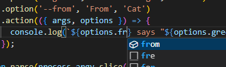

# Animaux

Javascript Library for CLI applications.

## Feature

- Type-hint



- Command and option definition

## Usage

#### Code

```js
#!/usr/bin/env node

const { program } = require('animaux');
const app = new program('greeting').version('1.0.0');

app
  .command('hello <name>')
  .describe('Greets the user')
  .option('--greet', 'Greet message', 'Hello')
  .option('--from', 'From', 'Cat')
  .action(({ args, options }) => {
    console.log(`${options.from} says "${options.greet}, ${args.name}"`);
  });

app.parse(process.argv.slice(2));
```

#### Result

```
$ greeting hello John
Cat says "Hello, John"

$ greeting hello John --from Dog --greet=Yo
Dog says "Yo, John"
```

#### `--help`

```
$ greeting --help

Usage
  $ greeting [command] [options]

Commands
  hello                Greets the user

Options (global)

Run '<command> --help' for more information on a command.
```

```
$ greeting build --help

Usage
  $ greeting hello <name>

Greets the user

Options (global)

Options (scoped)
  --greet              Greet message  (default: Hello)
  --from               From  (default: Cat)
```

## License

MIT
